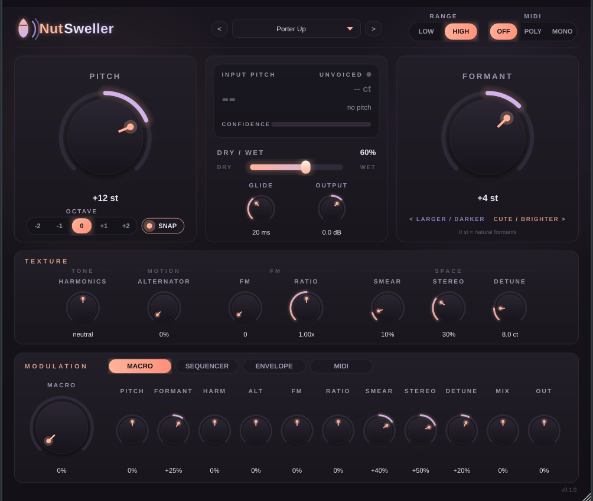

# NutSweller

A real-time vocal pitch / formant manipulator, tuned for bright, pitched-up-an-octave vocal layers.
VST3 (macOS, Windows, Linux), AU (macOS) and Standalone, built with JUCE and CMake. All DSP is written from scratch.



## Build

Requirements: CMake ≥ 3.22 and a C++17 compiler (Xcode 14+, Visual Studio 2022, GCC 11+/Clang 14+).
On Linux you also need JUCE's usual dev packages (ALSA, X11, Xrandr, Xinerama, Xcursor, Xext, Xi, freetype, fontconfig).

```sh
cmake -S . -B build -DCMAKE_BUILD_TYPE=Release        # fetches JUCE 9.0.2
cmake --build build --config Release
ctest --test-dir build -C Release                     # DSP unit tests
```

- To use a local JUCE checkout instead of downloading it, pass `-DFETCHCONTENT_SOURCE_DIR_JUCE=/path/to/JUCE`.
- macOS builds are universal (`arm64;x86_64`) by default, with a deployment target of 11.0.
- Windows uses the static MSVC runtime, so there is no redistributable to install.
- Plugins end up in `build/src/plugin/NutSweller_artefacts/Release/{VST3,AU,Standalone}`.
- `-DNUTSWELLER_BUILD_PLUGIN=OFF` builds only the JUCE-free DSP library, tests and tools. That build takes seconds.

**License note:** JUCE 8+ is dual-licensed under AGPLv3 and a commercial license. Distributing NutSweller binaries means
either releasing the source under AGPLv3 or holding a JUCE license.

## How it works

| Stage | Implementation |
|---|---|
| Pitch detection | YIN on the mono sum. The signal is band-limited and decimated to about 16–22 kHz for the full lag search, then the best lag is refined at the full rate with parabolic interpolation. Voicing uses aperiodicity hysteresis, a level gate and an octave-down guard. Ranges: **LOW** 50–500 Hz, **HIGH** 100–1000 Hz. |
| Pitch marks | One mark per glottal cycle. Each mark is predicted from the detected period and snapped to the peak of an adaptively low-passed copy of the input. Marks are shared by all channels and voices. |
| Pitch shift | TD-PSOLA. Synthesis marks are spaced at the output period, and each grain is a Hann-windowed two-period segment taken around the nearest analysis mark. |
| Formant | Each grain is resampled by the formant ratio before overlap-add, so pitch (grain spacing) and formant (grain content) move independently. Formant 0 keeps the natural formants. |
| Unvoiced | Breaths and consonants use time-aligned granular grains at 50% overlap. At formant 0 this is an exact identity, so they pass through untouched. |
| Dry/Wet | The dry signal is read from the input history at exactly the reported latency, so blends never comb-filter. |
| Harmonics | Feed-forward comb at half the output period. The sign of the gain tilts the odd/even harmonic balance. |
| Alternator | Every other synthesis cycle is stretched by up to one octave, adding sub-harmonic grit. |
| FM | Phase modulation of the resynthesized voice by a sine at `Ratio ×` the output fundamental. |
| Smear / Stereo / Detune | Grain position and size randomization, per-channel grain timing and mark choice, and an L/R pitch spread. |

### Latency

The shifter needs about 2.25 of the longest detectable periods, plus 1.5 ms of headroom for FM:

| Range | 44.1 kHz | 48 kHz | 96 kHz |
|---|---|---|---|
| HIGH (default) | 24.2 ms | 24.2 ms | 24.1 ms |
| LOW | ~46.5 ms | ~46.5 ms | ~46.4 ms |

Latency is reported with `setLatencySamples()` and updated when the range changes. Hosts compensate automatically,
though some only re-read latency when playback stops. Bypass keeps the same latency.

## Parameters

Pitch (±24 st, **SNAP** to semitones), Octave (±2), Formant (±12 st), Harmonics (−1…+1), Alternator, FM + Ratio
(0.25–8), Glide (0–500 ms, time to reach ~90% of a change), Smear, Stereo, Detune (0–50 ct), Dry/Wet, Output
(−24…+12 dB), Range (LOW/HIGH), MIDI mode (**OFF** / **POLY** up to 8 voices / **MONO** hard-tune to the last held
note), Velocity → Level / Formant / Harmonics / FM / Smear.

**Modulation:**

- **Macro:** one knob with a bipolar range for each of 11 destinations.
- **Sequencer:** 16 steps with a value and glide per step, 1/4…1/32 including triplets, synced to the host transport
  (free-running at host tempo when stopped), targeting Pitch or Formant.
- **ADSR:** triggered by MIDI notes or by input level, assignable to any destination.

All parameters are automatable and smoothed with two-pole smoothers, so automation doesn't zipper.

## Presets

| Preset | Settings |
|---|---|
| **Porter Up** (default) | Pitch +12, Formant +4, Glide 20 ms, Smear 10%, Stereo 30%, Detune 8 ct, Dry/Wet 60% |
| **Pure Octave** | Pitch +12, Formant 0, Dry/Wet 100% |
| **Chipmunk** | Pitch +12, Formant +12 |
| **Giant** | Octave −1, Formant −6 |
| **Glitch Choir** | Alternator 70%, Smear 50%, Stereo 100% |
| **Init** | Neutral |

Presets appear as host programs and in the header browser. The whole state, including UI size, is saved with the
session.

## Tests and tools

| Target | What it checks |
|---|---|
| `test_pitch_detector [vocal.wav]` | Sines, sweeps, a synthetic sung phrase (with breaths and an "s"), noise and silence at 44.1/48/96 kHz, in both ranges. It can also score a real recording against an offline full-rate reference YIN. |
| `test_shifter` | Latency alignment, output pitch accuracy for +12/+7/+3/−5/−12 st, spectral-envelope scaling for formant 0/+4/+12/−6, unvoiced pass-through, block-size independence and random automation. |
| `test_parameters` | One objective check per control, plus zipper-noise and MIDI mono/poly/velocity tests. |
| `test_modulation` | Macro, sequencer (free-running and host-synced) and ADSR (MIDI- and level-triggered). |
| `nutsweller_render` | Offline renderer, e.g. `nutsweller_render --in vocal.wav --out up.wav --preset "Porter Up"`, or `--pitch 12 --formant 4`. Run it with no arguments to list the options. |
| `nutsweller_bench` | CPU load across sample rates and block sizes. |

`renders/` contains example renders of a synthetic sung phrase (`00_input_sung_phrase.wav`):

- +12 st at formant 0 and +4
- each factory preset

The synthetic voice is only a stand-in, so run `nutsweller_render` on your own vocals to judge the sound.

### Validation

- pluginval at strictness 10 passes on the Linux VST3, 76 of 76 tests.
- CI (`.github/workflows/build.yml`) runs pluginval on macOS, Windows and Linux, plus `auval` on macOS.

CPU load on one core of a 2.8 GHz Xeon, stereo, with little variation across 32–2048-sample blocks:

| Scenario | 44.1 kHz | 48 kHz | 96 kHz |
|---|---|---|---|
| Porter Up | 1.3% | 1.2% | 2.2% |
| All effects and modulation on | 1.7% | 1.6% | 3.0% |
| All effects, POLY with 8 voices | ~10.5% | ~10.8% | ~21.5% |
